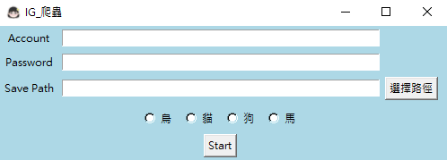
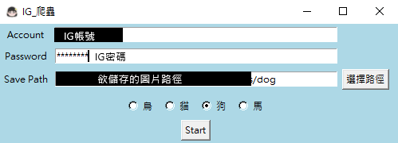
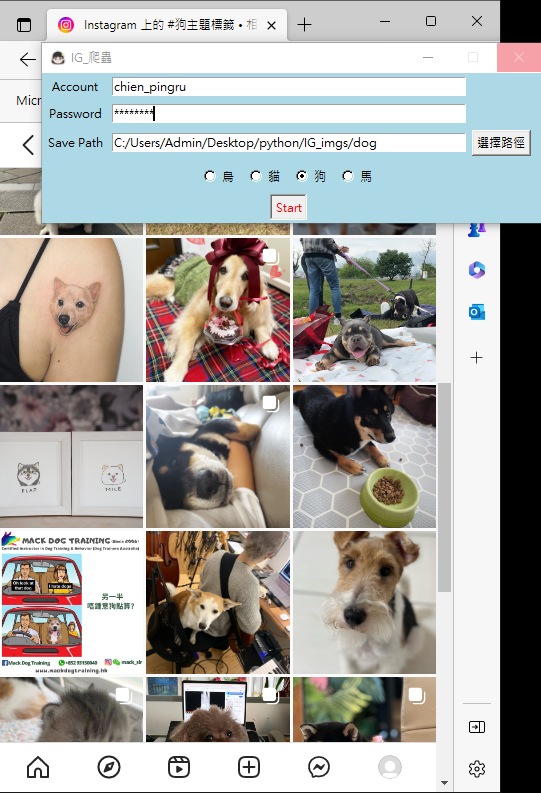
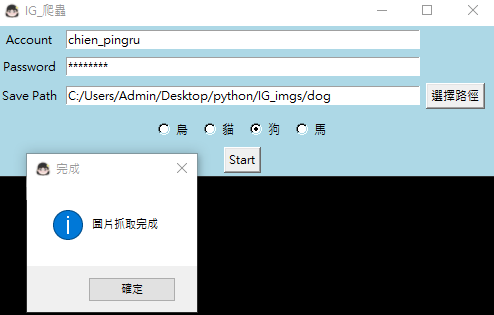
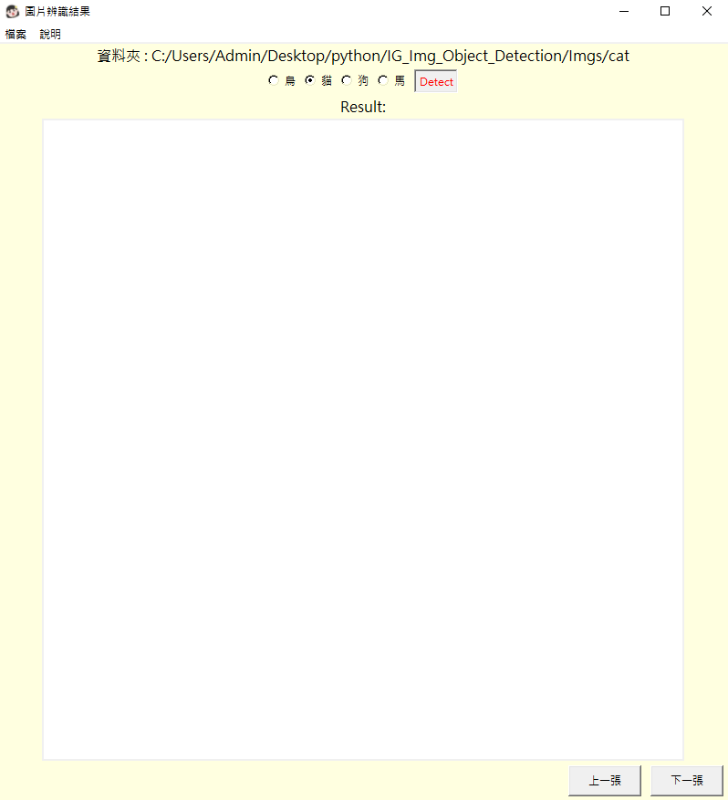
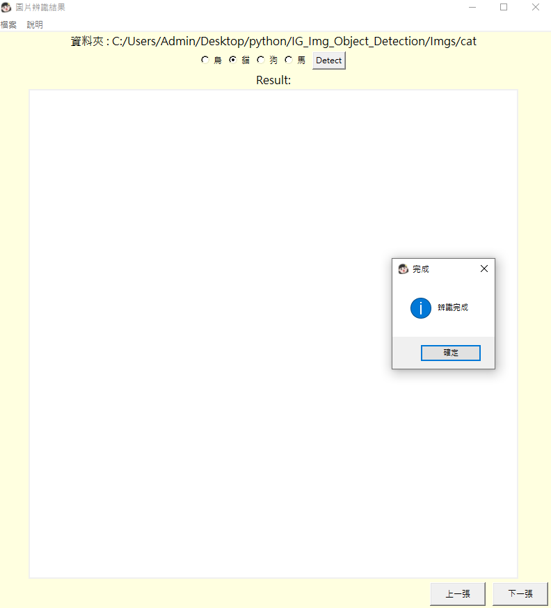
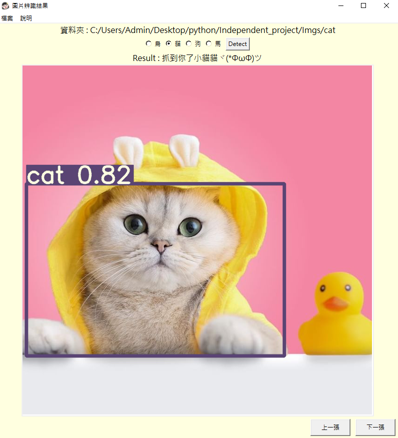
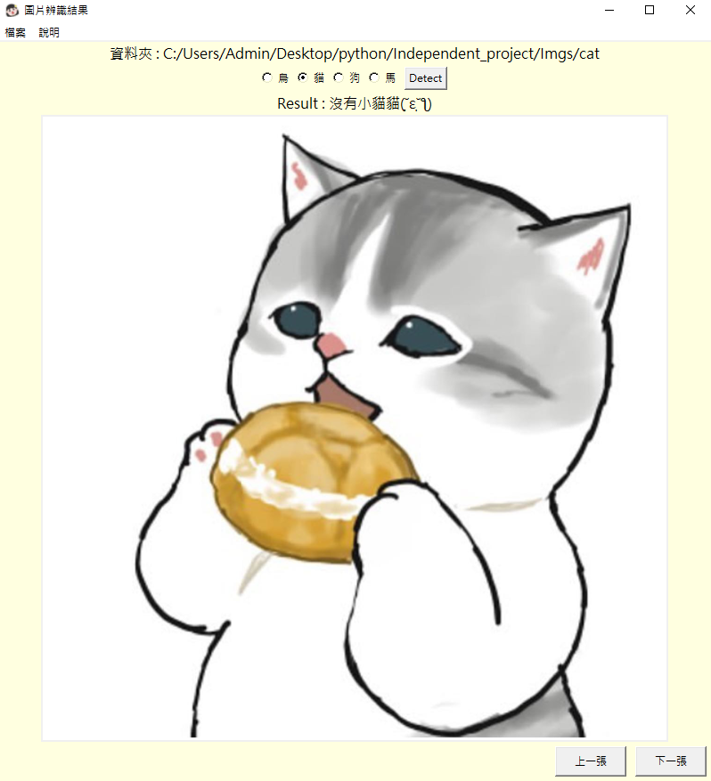
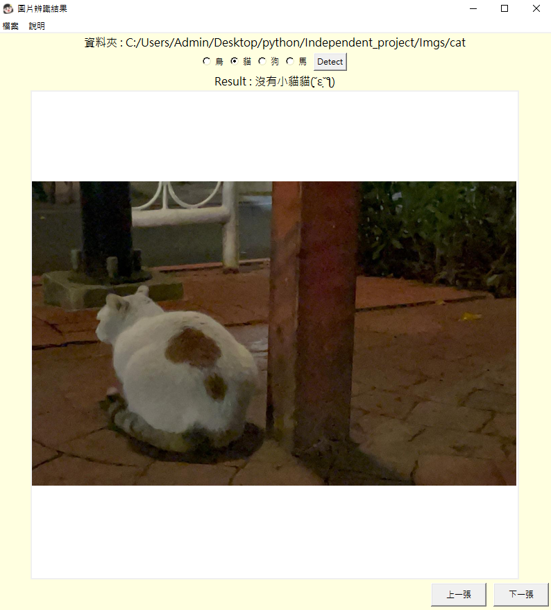

# IG圖片物件偵測

## 介紹
- 利用爬蟲selenium開啟Instagram,透過Hashtag搜尋關鍵字,將關鍵字的圖片下載下來
- 使用Tkinter製作GUI介面,並進行YOLOv7的辨識
- 目前辨識類別只有**貓**.**狗**.**馬**.**鳥**

## 事前準備
- 請先安裝YOLOv7環境 https://github.com/WongKinYiu/yolov7
``` shell
git clone https://github.com/WongKinYiu/yolov7
cd yolov7
pip install -r requirements.txt
```
- 安裝GUI所需套件
``` shell
pip install tkinter
pip install Pillow
```
## IG爬蟲
### 使用方法
- 在Account.Password地方輸入IG帳號及密碼
- 點擊選擇路徑按鈕,此路徑為爬到的圖片儲存位置,選擇完畢後可在中間輸入欄位確認是否正確,如需修改,亦可自行修正
- 按下Start按鈕後,文字會變成紅色,並自動開啟網頁進行爬蟲

<div align="center">
    <a href="./">
        
    </a>
    <a href="./">
        
    </a>
    <a href="./">
        
    </a>
    <a href="./">
        
    </a>
</div>

## 圖片物件辨識
### 使用方法
- 左上角新增檔案(選擇欲辨識的圖)
- 勾選需要辨識的類別
- 按下**Detect**按鈕,此時文字會呈現紅色,代表正在辨識中,需耐心等待
- 辨識完成後會跳出訊息視窗,按下確定後即可在中間看到辨識後的圖片
### 結果
- 辨識是否成功會呈現於圖片上方
- 如果為擬人繪畫圖或是特徵不明顯的照片,容易辨識不出來
<div align="center">
    <a href="./">
        
    </a>
    <a href="./">
        
    </a>    
    <a href="./">
        
    </a>
</div>
<div align="center">
    <a href="./">
        
    </a>
    <a href="./">
        
    </a>
</div>
